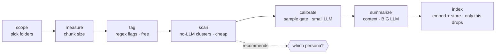
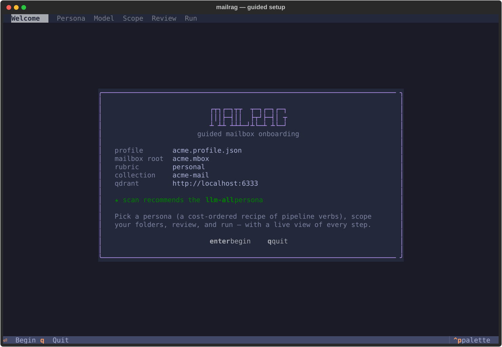
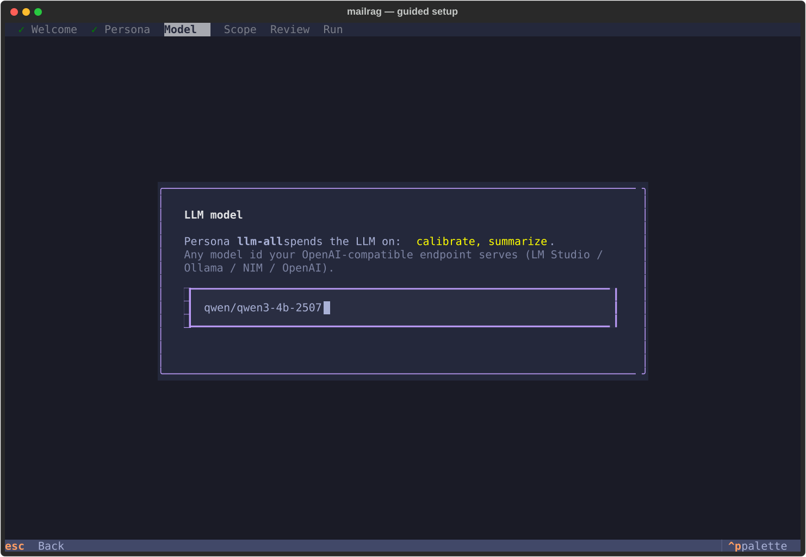
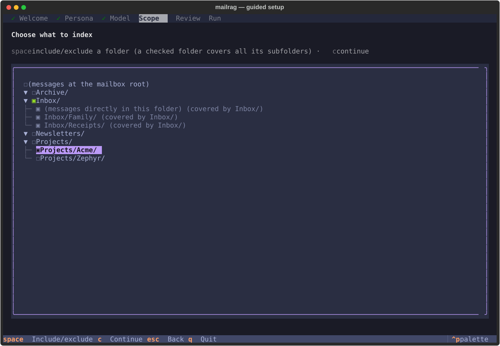
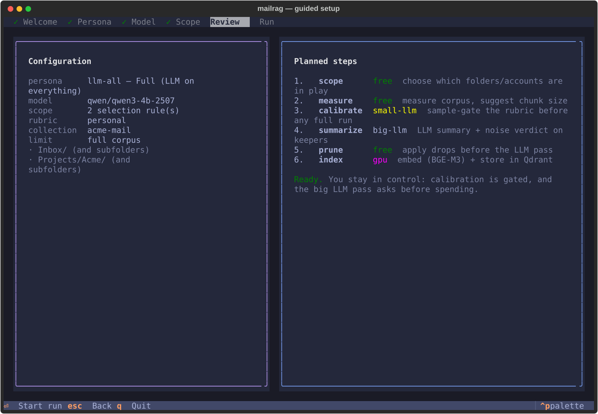
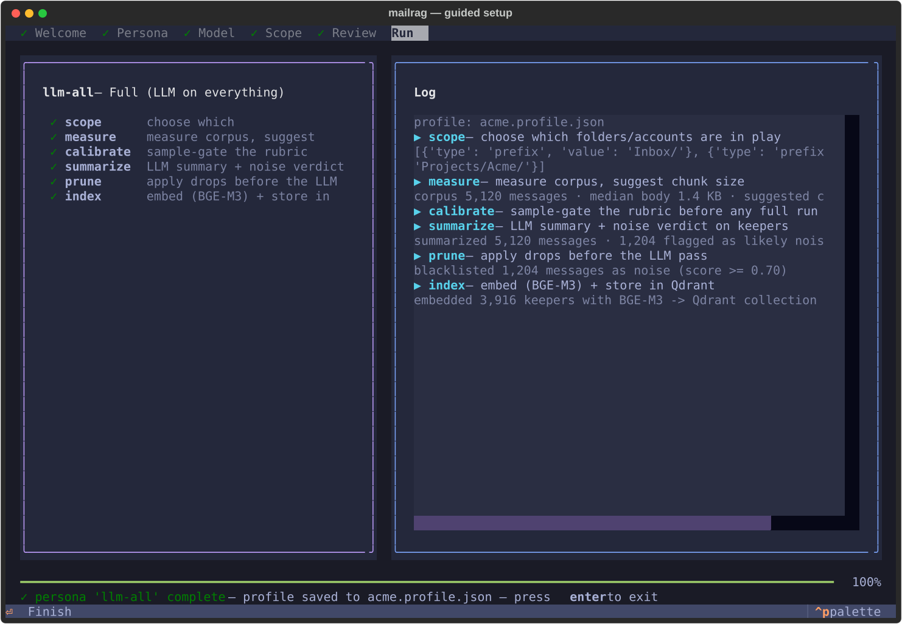

# A friendly guide to mailrag

What mailrag does, what to expect when you run it, and how to choose, without assuming
you have read the code. For the terse verb-by-verb reference, see [`VERBS.md`](VERBS.md).

## The big picture

mailrag turns a pile of `.eml` files into a question-answering assistant over your mail.
The work splits into two questions:

1. **Scope.** Which mail do we even consider? Your work folders, or everything?
2. **Noise and context.** Of that mail, what is junk, and what context should be
   attached so retrieval works?

The second question is a funnel of cheap-to-expensive steps, and the golden rule is that
**only the last step, `index`, deletes anything.** Everything before it tags, measures,
judges, or just looks. Your original `.eml` files stay on disk throughout, so every
choice is reversible.



One cost dominates everything else: the **LLM pass over each email**. So the lever that
matters is how many emails you send to the LLM. Embedding, regex and clustering are all
cheap by comparison.

## Pick a persona, which is the one decision that matters

A **persona** is a recipe, meaning which verbs run in what order, for a given
budget-against-quality trade. You never wire verbs by hand. You pick a persona and
mailrag walks it.

| Persona | Use it when… | LLM cost | Quality |
|---------|--------------|----------|---------|
| **`llm-none`** | You want it fast and don't need summary context. | none | noisy |
| **`llm-verify`** | You want great quality *and* your corpus has a lot of **obvious** noise to skip cheaply.¹ | medium | high, safe |
| **`llm-all`** | You want the cleanest result and the LLM to look at every email. | high | best |

¹ `llm-verify` earns its place when `scan` shows a lot of *obvious* noise. Each LLM call is
dominated by reading the email body, so its saving over `llm-all` comes mainly from the
summaries it skips on the dropped bulk, plus the safety of LLM-confirmed drops, rather than
from a big cut in body processing. With little obvious noise, `llm-all` is simpler. Before
any drop, `prune` shows a sample of what it will blacklist and asks.

Not sure which? Run `scan` first. It is free, spends no LLM, and it tells you:

```text
$ ./mailrag scan --profile mybox.profile.json
scan: 186 threads / 188 emails, k=10, seed=11, baseline tag rate=0.022
┏━━━━┳━━━━━━━━━┳━━━━━━━┳━━━━━━━━━━┳━━━━━━━━━━━━━━━━━━━━━━━━━━━━━━┳━━━━━━━┓
┃ id ┃ threads ┃ score ┃ tag_lift ┃ top_sender (share)          ┃ tight ┃
┡━━━━╇━━━━━━━━━╇━━━━━━━╇━━━━━━━━━━╇━━━━━━━━━━━━━━━━━━━━━━━━━━━━━━╇━━━━━━━┩
│ 0  │ 4       │ 0.77  │ 23.25    │ support@tripit.com (50%)    │ 0.80  │
│ 1  │ 27      │ 0.61  │ 1.72     │ no-reply@accounts.google.com│ 0.80  │
│ 9  │ 6       │ 0.61  │ 0.00     │ d.marsh@northwind.example   │ 0.82  │
│ …  │         │       │          │                             │       │
└────┴─────────┴───────┴──────────┴──────────────────────────────┴───────┘
recommended persona: llm-verify — 38% of threads sit in obvious noise pockets —
trim them with a cheap LLM check (llm-verify), or skip the LLM entirely (llm-none)
```

A `tag_lift` well above 1 alongside a dominant `no-reply@` or automated sender marks an
obvious noise pocket. The bigger that share, the more a budget persona saves you.

## What to expect from the wizard

`./mailrag wizard --profile mybox.profile.json` opens a full-screen TUI built with
[Textual](https://textual.textualize.io/), which walks the whole pipeline as a sequence
of screens. A breadcrumb at the top always shows where you are:

```text
✓ Welcome  ✓ Persona  ✓ Model  [ Scope ]  Review  Run
```

1. **Welcome.** The profile you are onboarding, meaning mailbox root, rubric and
   collection, plus the recommended persona if you ran `scan`. `enter` begins.

   
2. **Persona.** The personas on the left, a live preview of the highlighted recipe on
   the right: every verb with a colour-coded cost badge from `free` to `gpu`, and the
   `scan` recommendation starred and pre-highlighted.

   
3. **Model.** Only for LLM personas, and skipped when you passed `--model`. It asks for
   the model id your OpenAI-compatible endpoint serves, and rejects blank input inline.

   
4. **Scope.** The folder picker, as a navigable tree of your mailbox: top-level folders,
   their subfolders, plus "messages directly in …" rows. `space` includes or excludes,
   checking a folder covers all its subfolders and greys the children out, and a rule
   counter confirms what you have built. `c` continues, and you cannot proceed with
   nothing selected.

   
5. **Review.** Everything on one screen before anything runs: persona, model, scope
   rules, rubric, limit, and the exact planned steps, with skipped optional steps
   marked. `enter` starts, `esc` goes back to change anything.

   
6. **Run.** The recipe as a live ladder (`○` pending, `▶` running, `✓` done) next to a
   streaming log, with an overall progress bar. Long steps no longer freeze the
   terminal, because the pipeline runs in a worker while the UI stays live.

   

`esc` steps back, `q` quits, and the footer always lists the active keys.

Two human checkpoints interrupt the run as modal dialogs, and keep you in control:

- **The calibrate gate.** Before any full LLM run you see a *sample* of what the rubric
  would flag, meaning the suspected over-drops and under-drops. If it looks wrong,
  **re-tune** with `r` to pick another rubric and re-calibrate, then re-check. Only
  **proceed** with `p` once you trust it. This gate exists because a mis-tuned rubric
  once cost about 8 hours of LLM time on the wrong call.
- **Confirm-before-spend.** Right before the expensive summary pass, mailrag asks. So
  does `prune`, which shows a sample of what it would blacklist before writing
  anything.

> The screenshots above are auto-generated from the real app, driven headlessly against a
> **synthetic** demo mailbox with no real mail, no Qdrant and no LLM, so they stay in sync
> with the code. Regenerate them with `python scripts/gen_tui_screenshots.py`.

Prefer the old line-by-line prompt flow? It is kept as `./mailrag wizard --classic`. For
non-interactive or scripted runs there is a headless equivalent,
`./mailrag run --profile … --persona <name> [--model <m>]`, which uses the same recipes and
the same handlers with no prompts.

## Quick start

```bash
# 1. create/scope a profile, measure it
./mailrag scope   --profile mybox.profile.json     # pick folders (interactive)
./mailrag measure --profile mybox.profile.json     # suggest chunk size

# 2. (optional, free) see where the noise is and get a recommendation
./mailrag scan    --profile mybox.profile.json

# 3. let the wizard walk the rest — or run a persona headlessly
./mailrag wizard  --profile mybox.profile.json
./mailrag run     --profile mybox.profile.json --persona llm-all --model <llm>
#    add --limit N to wizard/run for a fast end-to-end test on a small sample
#    (caps the scan/summarize/index steps) instead of a full multi-hour rebuild

# 4. ask questions
./mailrag ask "what did Alice say about the budget?" --profile mybox.profile.json
```

## Power use & custom personas

Every step is also a standalone verb (`./mailrag tag`, `./mailrag calibrate`, and so on),
so you can run the pipeline by hand. Personas live in
[`personas.yaml`](../personas.yaml). Add an entry there, or in a gitignored
`personas.local.yaml`, to define your own recipe, and both the wizard and `run` will read
it. See [`VERBS.md`](VERBS.md) for the full ladder and the cost of each verb.

## Attachments

Attachments are stored separately from email bodies. The three commands are:

```bash
# ingest a profile's attachment bytes into the content-addressed store
./mailrag attachments build --profile <profile.json> [--limit N]

# list a thread's / message's attachments (prints full sha256s)
./mailrag attachments list --thread-id <id>        # or --message-id <id>

# fetch one attachment by sha256: extract + print its text, or write raw bytes
./mailrag attachments get <sha256> --text [--extractor llm|tesseract] [--force]
./mailrag attachments get <sha256> --out <path>    # raw bytes (always available)
```

Text extraction runs lazily on `get --text` and is cached. `--extractor` overrides the
`RAG_ATTACH_EXTRACTOR` env var for that call, and `--force` re-extracts even when a result
is already cached. `build` also accepts `--extractor` for forward compatibility, but it
does not extract text today. It only ingests bytes.

The default OCR backend is a **local vision LLM**, gemma-4 via LM Studio, which keeps the
work on-device. It falls back automatically to local **tesseract** when the LLM is
unavailable. Cloud OCR is opt-in and not yet implemented.

For setup details (optional Python deps, system packages, config vars), see
[`SETUP.md § 9`](SETUP.md#9-attachment-extraction).
