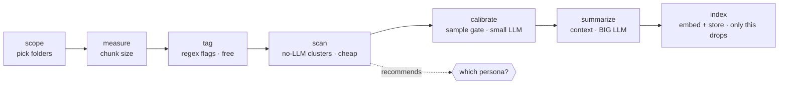

# mailrag — a friendly guide

This guide explains **what mailrag does, what to expect when you run it, and how to
choose** — without assuming you've read the code. For the terse verb-by-verb
reference, see [`VERBS.md`](VERBS.md).

## The big picture

mailrag turns a pile of `.eml` files into a question-answering assistant over your
mail. The work splits into two questions:

1. **Scope** — *which* mail do we even consider? (your work folders? everything?)
2. **Noise & context** — of that mail, *what's junk*, and *what context* do we attach
   so retrieval is good?

The second question is a **funnel of cheap-to-expensive steps**, and the golden rule
is: **only the last step (`index`) deletes anything.** Everything before it tags,
measures, judges, or just *looks* — your original `.eml` files always stay on disk, so
every choice is reversible.



The single cost that dominates is the **LLM pass over each email**. So the one lever
that matters is: *how many emails do we send to the LLM?* Everything else (embedding,
regex, clustering) is cheap.

## Pick a persona (the one decision that matters)

A **persona** is a recipe — which verbs, in what order — for a budget/quality
tradeoff. You don't wire verbs by hand; you pick a persona and mailrag walks it.

| Persona | Use it when… | LLM cost | Quality |
|---------|--------------|----------|---------|
| **`llm-none`** | You want it fast and don't need summary context. | none | noisy |
| **`llm-verify`** | You want great quality *and* your corpus has a lot of **obvious** noise to skip cheaply.¹ | medium | high, safe |
| **`llm-all`** | You want the cleanest result and the LLM to look at every email. | high | best |

¹ `llm-verify` is most worth it when `scan` shows a lot of *obvious* noise. Because each
LLM call is dominated by reading the email body, its saving over `llm-all` is mainly the
summaries it skips on the dropped bulk (plus the safety of LLM-confirmed drops), not a big
body-processing cut — so if there's little obvious noise, `llm-all` is simpler. Before any
drop, `prune` shows a sample of what it will blacklist and asks.

**Don't know which?** Run `scan` first — it's free (no LLM) and it *tells you*:

```text
$ mailrag scan --profile mybox.profile.json
scan: 186 threads / 188 emails, k=10, seed=11, baseline tag rate=0.022
┏━━━━┳━━━━━━━━━┳━━━━━━━┳━━━━━━━━━━┳━━━━━━━━━━━━━━━━━━━━━━━━━━━━━━┳━━━━━━━┓
┃ id ┃ threads ┃ score ┃ tag_lift ┃ top_sender (share)          ┃ tight ┃
┡━━━━╇━━━━━━━━━╇━━━━━━━╇━━━━━━━━━━╇━━━━━━━━━━━━━━━━━━━━━━━━━━━━━━╇━━━━━━━┩
│ 0  │ 4       │ 0.77  │ 23.25    │ support@tripit.com (50%)    │ 0.80  │
│ 1  │ 27      │ 0.61  │ 1.72     │ no-reply@accounts.google.com│ 0.80  │
│ 9  │ 6       │ 0.61  │ 0.00     │ awensley@layer7tech.com     │ 0.82  │
│ …  │         │       │          │                             │       │
└────┴─────────┴───────┴──────────┴──────────────────────────────┴───────┘
recommended persona: llm-verify — 38% of threads sit in obvious noise pockets —
trim them with a cheap LLM check (llm-verify), or skip the LLM entirely (llm-none)
```

`tag_lift` ≫ 1 and a dominant `no-reply@`/automated sender = an obvious noise pocket.
The bigger that share, the more a budget persona saves you.

## What to expect from the wizard

`mailrag wizard --profile mybox.profile.json` walks you through it:

```text
scan recommends: llm-all
  llm-none  — Body-only (no LLM): fast, no LLM at all; body-only index
  llm-verify — Verified trim: a cheap LLM confirms drops on the obvious pockets
  llm-all   — Full (LLM on everything): one LLM call per email, then index drops noise
? Choose a persona:  (Use arrow keys)
 » llm-all
   llm-verify
   llm-none

  ▶ scope — choose which folders/accounts are in play
  ▶ measure — measure corpus, suggest chunk size
  ▶ calibrate — sample-gate the rubric before any full run

  rubric 'personal' — sample n=200   noise rate 61%
  [FALSE-NOISE suspects: record-ish but flagged noise] 12
    - bank statement Q3 …            (flagged noise: "promotional")
  [FALSE-KEEP suspects: promo-ish but kept] 3
    - 50% off this weekend …

? Calibration done. What next?
 » proceed to the LLM pass
   re-tune (pick another rubric and re-calibrate)
   abort

? Run the LLM summary pass over the keep set?  (y/N)   ← confirm-before-spend
  ▶ summarize — LLM summary + noise verdict on keepers
  ▶ index — embed (BGE-M3) + store in Qdrant
persona 'llm-all' complete -> mybox.profile.json
```

Two human checkpoints keep you in control:

- **The calibrate gate.** Before any full LLM run, you see a *sample* of what the
  rubric would flag — the suspected over-/under-drops. If it looks wrong, **re-tune**
  (try another rubric) and re-check; only **proceed** when you trust it. (This exists
  because a mis-tuned rubric once cost ~8 hours of LLM on the wrong call.)
- **Confirm-before-spend.** Right before the expensive summary pass, mailrag asks
  before spending the LLM.

## Quick start

```bash
# 1. create/scope a profile, measure it
mailrag scope   --profile mybox.profile.json     # pick folders (interactive)
mailrag measure --profile mybox.profile.json     # suggest chunk size

# 2. (optional, free) see where the noise is and get a recommendation
mailrag scan    --profile mybox.profile.json

# 3. let the wizard walk the rest — or run a persona headlessly
mailrag wizard  --profile mybox.profile.json
mailrag run     --profile mybox.profile.json --persona llm-all --model <llm>

# 4. ask questions
mailrag ask "what did Alice say about the budget?" --profile mybox.profile.json
```

## Power use & custom personas

Every step is also a standalone verb (`mailrag tag`, `mailrag calibrate`, …), so you
can run the pipeline by hand. Personas live in [`personas.yaml`](../personas.yaml) —
add an entry (or a gitignored `personas.local.yaml`) to define your own recipe; the
wizard and `run` both read it. See [`VERBS.md`](VERBS.md) for the full ladder and the
cost of each verb.
