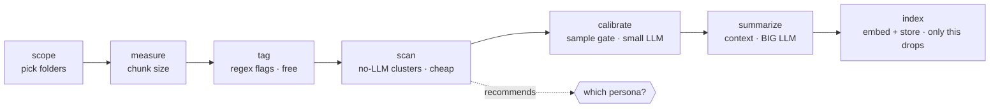

# mailrag — a friendly guide

This guide explains **what mailrag does, what to expect when you run it, and how to
choose** — without assuming you've read the code. For the terse verb-by-verb
reference, see [`VERBS.md`](VERBS.md).

## The big picture

mailrag turns a pile of `.eml` files into a question-answering assistant over your
mail. The work splits into two questions:

1. **Scope** — *which* mail do we even consider? (your work folders? everything?)
2. **Noise & context** — of that mail, *what's junk*, and *what context* do we attach
   so retrieval is good?

The second question is a **funnel of cheap-to-expensive steps**, and the golden rule
is: **only the last step (`index`) deletes anything.** Everything before it tags,
measures, judges, or just *looks* — your original `.eml` files always stay on disk, so
every choice is reversible.



The single cost that dominates is the **LLM pass over each email**. So the one lever
that matters is: *how many emails do we send to the LLM?* Everything else (embedding,
regex, clustering) is cheap.

## Pick a persona (the one decision that matters)

A **persona** is a recipe — which verbs, in what order — for a budget/quality
tradeoff. You don't wire verbs by hand; you pick a persona and mailrag walks it.

| Persona | Use it when… | LLM cost | Quality |
|---------|--------------|----------|---------|
| **`llm-none`** | You want it fast and don't need summary context. | none | noisy |
| **`llm-verify`** | You want great quality *and* your corpus has a lot of **obvious** noise to skip cheaply.¹ | medium | high, safe |
| **`llm-all`** | You want the cleanest result and the LLM to look at every email. | high | best |

¹ `llm-verify` is most worth it when `scan` shows a lot of *obvious* noise. Because each
LLM call is dominated by reading the email body, its saving over `llm-all` is mainly the
summaries it skips on the dropped bulk (plus the safety of LLM-confirmed drops), not a big
body-processing cut — so if there's little obvious noise, `llm-all` is simpler. Before any
drop, `prune` shows a sample of what it will blacklist and asks.

**Don't know which?** Run `scan` first — it's free (no LLM) and it *tells you*:

```text
$ mailrag scan --profile mybox.profile.json
scan: 186 threads / 188 emails, k=10, seed=11, baseline tag rate=0.022
┏━━━━┳━━━━━━━━━┳━━━━━━━┳━━━━━━━━━━┳━━━━━━━━━━━━━━━━━━━━━━━━━━━━━━┳━━━━━━━┓
┃ id ┃ threads ┃ score ┃ tag_lift ┃ top_sender (share)          ┃ tight ┃
┡━━━━╇━━━━━━━━━╇━━━━━━━╇━━━━━━━━━━╇━━━━━━━━━━━━━━━━━━━━━━━━━━━━━━╇━━━━━━━┩
│ 0  │ 4       │ 0.77  │ 23.25    │ support@tripit.com (50%)    │ 0.80  │
│ 1  │ 27      │ 0.61  │ 1.72     │ no-reply@accounts.google.com│ 0.80  │
│ 9  │ 6       │ 0.61  │ 0.00     │ awensley@layer7tech.com     │ 0.82  │
│ …  │         │       │          │                             │       │
└────┴─────────┴───────┴──────────┴──────────────────────────────┴───────┘
recommended persona: llm-verify — 38% of threads sit in obvious noise pockets —
trim them with a cheap LLM check (llm-verify), or skip the LLM entirely (llm-none)
```

`tag_lift` ≫ 1 and a dominant `no-reply@`/automated sender = an obvious noise pocket.
The bigger that share, the more a budget persona saves you.

## What to expect from the wizard

`mailrag wizard --profile mybox.profile.json` opens a **full-screen TUI**
([Textual](https://textual.textualize.io/)) that walks the whole pipeline as a
sequence of screens — a breadcrumb at the top always shows where you are:

```text
✓ Welcome  ✓ Persona  ✓ Model  [ Scope ]  Review  Run
```

1. **Welcome** — the profile you're onboarding (mailbox root, rubric,
   collection) and, if you ran `scan`, its recommended persona. `enter` begins.
2. **Persona** — the personas on the left, a live preview of the highlighted
   recipe on the right: every verb with a colour-coded cost badge
   (`free` → `gpu`), the `scan` recommendation starred and pre-highlighted.
3. **Model** — only for LLM personas (and skipped when you passed `--model`):
   the model id your OpenAI-compatible endpoint serves. Blank input is
   rejected inline.
4. **Scope** — the folder picker as a navigable tree of your mailbox (top-level
   folders, their subfolders, plus "messages directly in …" rows). `space`
   includes/excludes; checking a folder covers all its subfolders (children
   grey out); a rule counter confirms what you've built. `c` continues —
   you can't proceed with nothing selected.
5. **Review** — everything on one screen before anything runs: persona, model,
   scope rules, rubric, limit, and the exact planned steps (optional steps that
   will be skipped are marked). `enter` starts, `esc` goes back to change
   anything.
6. **Run** — the recipe as a live ladder (`○` pending, `▶` running, `✓` done)
   next to a streaming log, with an overall progress bar. Long steps no longer
   freeze the terminal — the pipeline runs in a worker while the UI stays live.

`esc` steps back, `q` quits, and the footer always lists the active keys.

Two human checkpoints interrupt the run as modal dialogs, and keep you in control:

- **The calibrate gate.** Before any full LLM run, you see a *sample* of what the
  rubric would flag — the suspected over-/under-drops. If it looks wrong, **re-tune**
  (`r`: pick another rubric, re-calibrate) and re-check; only **proceed** (`p`) when
  you trust it. (This exists because a mis-tuned rubric once cost ~8 hours of LLM on
  the wrong call.)
- **Confirm-before-spend.** Right before the expensive summary pass, mailrag asks
  before spending the LLM. (`prune` likewise shows a sample of what it would
  blacklist before writing anything.)

Prefer the old line-by-line prompt flow? It's kept as `mailrag wizard --classic`.
For non-interactive / scripted runs, use the headless equivalent:
`mailrag run --profile … --persona <name> [--model <m>]` — same recipes, same
handlers, no prompts.

## Quick start

```bash
# 1. create/scope a profile, measure it
mailrag scope   --profile mybox.profile.json     # pick folders (interactive)
mailrag measure --profile mybox.profile.json     # suggest chunk size

# 2. (optional, free) see where the noise is and get a recommendation
mailrag scan    --profile mybox.profile.json

# 3. let the wizard walk the rest — or run a persona headlessly
mailrag wizard  --profile mybox.profile.json
mailrag run     --profile mybox.profile.json --persona llm-all --model <llm>
#    add --limit N to wizard/run for a fast end-to-end test on a small sample
#    (caps the scan/summarize/index steps) instead of a full multi-hour rebuild

# 4. ask questions
mailrag ask "what did Alice say about the budget?" --profile mybox.profile.json
```

## Power use & custom personas

Every step is also a standalone verb (`mailrag tag`, `mailrag calibrate`, …), so you
can run the pipeline by hand. Personas live in [`personas.yaml`](../personas.yaml) —
add an entry (or a gitignored `personas.local.yaml`) to define your own recipe; the
wizard and `run` both read it. See [`VERBS.md`](VERBS.md) for the full ladder and the
cost of each verb.

## Attachments

Attachments are stored separately from email bodies. The three commands are:

```bash
# ingest a profile's attachment bytes into the content-addressed store
mailrag attachments build --profile <profile.json> [--limit N]

# list a thread's / message's attachments (prints full sha256s)
mailrag attachments list --thread-id <id>        # or --message-id <id>

# fetch one attachment by sha256: extract + print its text, or write raw bytes
mailrag attachments get <sha256> --text [--extractor llm|tesseract] [--force]
mailrag attachments get <sha256> --out <path>    # raw bytes (always available)
```

Text extraction runs lazily on `get --text` (and is cached). `--extractor` overrides
the `RAG_ATTACH_EXTRACTOR` env var for that call, and `--force` re-extracts even when a
result is already cached. (`build` also accepts `--extractor` for forward compatibility,
but does not extract text today — it only ingests bytes.)

The default OCR backend is the **local vision-LLM (gemma-4 via LM Studio)** —
on-device and private — with automatic fallback to local **tesseract** when the LLM
is unavailable. Cloud OCR is opt-in and not yet implemented.

For setup details (optional Python deps, system packages, config vars), see
[`SETUP.md § 9`](SETUP.md#9-attachment-extraction).
